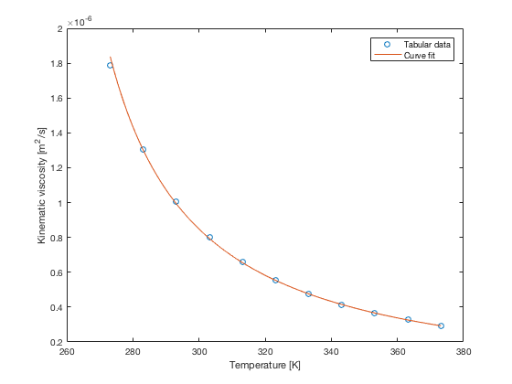
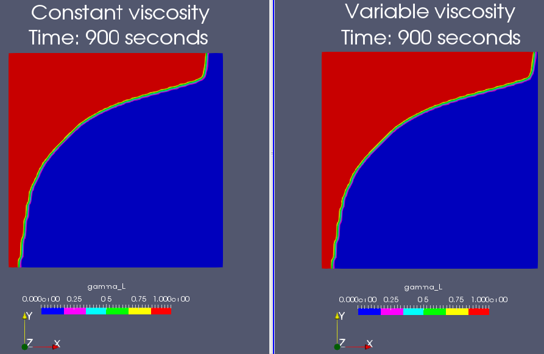

# CoMeTFoam
[](https://travis-ci.org/geo-fluid-dynamics/CoMeTFoam)


Convection-diffusion phase change solver for OpenFOAM 5.0. It is based on the official _buoyantBoussinesqPimpleFoam_ solver.

[Geo Fluid Dynamics](https://blog.rwth-aachen.de/gfd/) - A research group at RWTH Aachen University<br>
Author: Kai Schüller (<schueller@aices.rwth-aachen.de>)

## Table of Contents
- [Current capabilities](#current-capabilities)
- [Getting started](#getting-started)
  - [OpenFOAM](#openfoam)
  - [CoMeTFoam](#cometfoam-1)
- [User instructions](#user-instructions)
  - [Setting the viscosity](#setting-the-viscosity)
- [Developer Instructions](#developer-instructions)
- [RWTH Compute Cluster](#rwth-compute-cluster)
- [Examples](#examples)
  - [Stefan problem](#stefan-problem)
  - [Cavity melting](#cavity-melting)
- [References](#references)

## Current capabilities

## Getting started

### OpenFOAM
CoMeTFoam is a custom solver for [OpenFOAM](https://openfoam.org). Therefore it must be installed first. Depending on the operating system (Ubuntu, Linux, MacOS, Windows using Windows Subsystem for Linux with Ubuntu packs), different options are available, which are very good described on the official [download page](https://openfoam.org/version/5-0/).

To give an example, we will summarize the steps, which are necessary to use the OpenFOAM 5.0 docker image on MacOS in the following:

1) Install [Docker for MacOS](https://docs.docker.com/docker-for-mac/)

2) Download two scripts and make them executable
```
sudo curl --create-dirs -o /usr/local/bin/openfoam5-macos http://dl.openfoam.org/docker/openfoam5-macos
sudo chmod 755 /usr/local/bin/openfoam5-macos
sudo curl -o /usr/local/bin/openfoam-macos-file-system http://dl.openfoam.org/docker/openfoam-macos-file-system
sudo chmod 755 /usr/local/bin/openfoam-macos-file-system
```
3) Create a 10GB file system (look [here](https://openfoam.org/download/5-0-macos/) for other options)
```
openfoam-macos-file-system create
```
4) Mount the file system
```
openfoam-macos-file-system mount
```
5) Launching OpenFOAM
```
cd $HOME/openfoam
openfoam5-macos
```
6) Test if OpenFOAM runs as expected
```
cd $FOAM_RUN
cp -r $FOAM_TUTORIALS/incompressible/simpleFoam/pitzDaily .
cd pitzDaily
blockMesh
simpleFoam
```

### CoMeTFoam
1) Download CoMeTFoam
```
git clone git@github.com:geo-fluid-dynamics/CoMeTFoam.git
```
2) Compile the solver
```
cd CoMeTFoam
wmake
```
3) Test if CoMeTFoam runs as expected
```
cd ../tests
./Alltest

```

## User instructions
### Setting the viscosity
_CoMeTFoam_ provides the option to set a temperature dependent kinematic viscosity. This can be done by changing the values of _nua_, _nub_ and _nuc_ in _constant/transportProperties_.

To give an example, we will now discuss how to choose the correct parameters for pure water. Its kinematic viscosity is summarized in the following table.

|Temperature [K]|kin. Viscosity [10^(-6) m^2/s]|
|-|-|
|273.15 (0 °C)|1.787|
|283.15 (10 °C)|1.307|
|293.15 (20 °C)|1.004|
|303.15 (30 °C)|0.801|
|313.15 (40 °C)|0.658|
|323.15 (50 °C)|0.553|
|333.15 (60 °C)|0.475|
|343.15 (70 °C)|0.413|
|353.15 (80 °C)|0.365|
|363.15 (90 °C)|0.326|
|373.15 (100 °C)|0.294|

source: [engineeringtoolbox](http://www.engineeringtoolbox.com/water-dynamic-kinematic-viscosity-d_596.html)

We can approximate those tabular values with the following equation


Curve fitting yields for the tabular data:
- nua = -2.327547e+05 s/m^2
- nub = -1.608951e+04 s/m^2/K
- nuc = 6.931645e+01 s/m^2/K^2



## Developer instructions
1) [Fork this repository](https://github.com/geo-fluid-dynamics/CoMeTFoam/fork)

2) Check out the source code with:
```
git clone git@github.com:YOUR_GITHUB_USERNAME/CoMeTFoam.git
```
3) Start a new branch with:
```
cd CoMeTFoam
git checkout -b yournewbranch
```
4) Add new stuff

5) Make sure that the tests passes
```
cd tests
./Alltest
```
6) Add the changes, commit and push
```
git add CoMeTFoam/yourchanges
git commit -m 'describe the changes'
git push origin yournewbranch
```
7) Finally, [create a pull request](https://help.github.com/articles/creating-a-pull-request).

## RWTH Compute Cluster
In this section, we describe how to use CoMeTFoam on the RWTH Compute Cluster. If you don't have access, you can skip this section. However, if you have access to a different Compute Cluster some steps might be similar.
```
module load TECHNICS
module load openfoam/5.0
```
The Standard command to run an OpenFOAM solver in parallel does not work on the cluster. Therefore, the _Allrun_ scripts do not work until the line
```
...
runParallel $(getApplication)
...
```
is replaced with
```
...
$MPIEXEC $FLAGS_MPI_BATCH foamExec CoMeTFoam -parallel
...
```
In order to replace this line in the _Allrun_ script, run
```
mv Allrun AllrunOld
sed -e 's!runParallel $(getApplication)!$MPIEXEC $FLAGS_MPI_BATCH foamExec CoMeTFoam -parallel!g' AllrunOld > Allrun
chmod +x Allrun
```
And to revert this change
```
mv AllrunOld Allrun
```
A better practice is to submit a job to the cluster. An example of a job script is found in _etc/job.sh_. Make sure to change the line that sets the _-n_ flag to the correct number of compute slots that are needed to run the case. Once the job script is copied to the case directory, run
```
bsub < job.sh
```
to submit the job.

## Examples
The examples, which are shown here can be found in the [_examples_](https://github.com/geo-fluid-dynamics/CoMeTFoam/tree/feature/StefanProblem/examples) folder.
### Stefan problem


The following plot shows a comparison between the solution of _CoMeTFoam_ and the [analytical solution](https://github.com/geo-fluid-dynamics/benchmarks/tree/master/two-phase-stefan-problem) to the Stefan problem using the same thermo-physical properties.


The plot can be repoduced by
```
cd examples/stefanProblem
./ConvergenceTestRun
python createPlots.py
```
The scripts first create copies of the folder _stefanProblem_ with different number of cells (320, 640, 1280 cells) and then runs _CoMeTFoam_ for each case.
Additionally the order of grid convergence can be calculated using
```
python calcConvergence.py
```
which yields 1.45869745565 for the considered meshes (320, 640, 1280 cells).

### Cavity melting
Two cavity melting examples are provided - _cavity_ and _cavityVarViscosity_. The first one uses a constant kinematic viscosity, whereas the latter uses a temperature dependent kinematic viscosity. The following picture shows the difference of those two cases.



## References
- Rösler, Fabian. _Modellierung und simulation der phasenwechselvorgänge in makroverkapselten latenten thermischen speichern_. Vol. 24. Logos Verlag Berlin GmbH, 2014.
